# Outbound Transaction Flows

This document describes all valid outbound transaction flows in the CEA-mediated architecture.
"Outbound" means: a user on Push Chain initiates a transaction that results in execution on an
external EVM chain (Ethereum, Base, Arbitrum, etc.).

---

## 1. Architecture Overview

### 1.1 Chain Roles and Contract Placement

| Chain          | Contract             | Role                                                                |
| -------------- | -------------------- | ------------------------------------------------------------------- |
| Push Chain     | `UniversalGatewayPC` | Outbound entry point; infers TX_TYPE; burns PRC20; swaps PC for gas fees |
| Push Chain     | `VaultPC`            | Receives protocol fee portion of gas fees (revenue)                      |
| External Chain | `Vault`              | TSS-controlled custody; deploys/funds CEA; calls executeUniversalTx |
| External Chain | `CEAFactory`         | Deterministic CREATE2 deployer for CEA contracts                    |
| External Chain | `CEA`                | Per-UEA smart contract wallet; executes multicall payloads          |
| External Chain | `UniversalGateway`   | Inbound entry point; handles CEA→UEA self-calls; processes reverts  |

### 1.2 Actors

| Actor   | Description                                                                                                                                                  |
| ------- | ------------------------------------------------------------------------------------------------------------------------------------------------------------ |
| **BOB** | The end user. Has a UEA (Universal Execution Account) on Push Chain and an associated CEA on the external chain.                                             |
| **UEA** | BOB's account on Push Chain — the address from which he calls `sendUniversalTxOutbound`.                                                                     |
| **TSS** | Off-chain Threshold Signature Scheme relayer operated by Push Chain validators. Observes `UniversalTxOutbound` events and calls `Vault.finalizeUniversalTx`. |
| **CEA** | BOB's Chain Execution Account on the external chain. Deterministically derived from BOB's UEA address. Holds tokens and executes multicalls on BOB's behalf. |

### 1.3 Token Model: PRC20 Burn/Mint Mechanics

PRC20 tokens are wrapped representations of external chain tokens on Push Chain.

- **Outbound withdrawal**: When `amount > 0`, `UniversalGatewayPC` burns PRC20 tokens from BOB. The corresponding tokens are released from `Vault` on the external chain.
- **Gas fees**: Paid in **native PC** via `msg.value`. The gateway sends `protocolFee` (native PC) directly to VaultPC, then swaps the remainder via `UniversalCore.swapAndBurnGas()`:
  - **`protocolFee`** (flat fee in native PC, from `UniversalCore.protocolFeeByToken`) is **sent to VaultPC** as protocol revenue before the swap.
  - **`gasFee`** (gas cost = `gasPrice × gasLimit`) is **burned** — freeing backing tokens on the origin chain for TSS relayers to spend on execution gas.
  - **Unused PC** is refunded directly to the caller.

### 1.4 TX_TYPE Reference

#### Push Chain (`UniversalGatewayPC._fetchTxType`, `src/UniversalGatewayPC.sol:140-149`)

| `req.payload` | `req.amount` | TX_TYPE             | PRC20 Burn | Description                                |
| ------------- | ------------ | ------------------- | ---------- | ------------------------------------------ |
| empty         | > 0          | `FUNDS`             | yes        | Pure withdrawal — deliver tokens to target |
| non-empty     | > 0          | `FUNDS_AND_PAYLOAD` | yes        | Withdraw + execute on external chain       |
| non-empty     | == 0         | `GAS_AND_PAYLOAD`   | no         | Execute using pre-existing CEA balance     |
| empty         | == 0         | ❌ reverts           | —          | Empty transaction, rejected                |

#### External Chain (`UniversalGateway._fetchTxType`, used for CEA→UEA self-calls)

All four TX_TYPEs are supported on the CEA→UEA path via `sendUniversalTxFromCEA`.

| `req.amount`           | `req.payload` | TX_TYPE             | Route    |
| ---------------------- | ------------- | ------------------- | -------- |
| == 0, native value > 0 | empty         | `GAS`               | Instant  |
| == 0                   | non-empty     | `GAS_AND_PAYLOAD`   | Instant  |
| > 0                    | empty         | `FUNDS`             | Standard |
| > 0                    | non-empty     | `FUNDS_AND_PAYLOAD` | Standard |

### 1.5 Multicall Payload: The CEA Execution Engine

All CEA operations route through a `Multicall[]` payload:

```solidity
struct Multicall {
    address to;      // Target contract address
    uint256 value;   // Native token amount to forward with this call
    bytes data;      // ABI-encoded call data
}

// Encoding:
bytes memory payload = abi.encode(multicallArray);
```

Key rules (`CEA.sol:182-207`):
- Calls execute sequentially; any revert fails the whole batch.
- No strict `sum(call.value) == msg.value` — CEA may spend pre-existing balance alongside Vault-supplied value (enables hybrid flows).
- Self-calls to CEA must have `value == 0`.
- **Empty payload**: CEA receives funds and holds them — nothing executed.

### 1.6 Funding Sources: BURN vs CEA Balance vs Hybrid

Users can either use 3 main routes for any outbound executions (Push Chain to Source Chain):
1. **BURN only**: Burn PRC20 on Push Chain → Vault releases tokens to CEA → CEA executes.
2. **CEA balance**: No burn; CEA uses tokens it already holds. Push Chain call uses `amount=0`.
3. **Hybrid**: Both — Vault-supplied tokens combine with CEA's pre-existing balance for execution.

---

## 2. Category 1 — Withdrawal Flows

Source-Chain Withdrawals deliver tokens to an address on the external chain (EOA, contract, or
any recipient). Push Chain burns PRC20 → Vault releases tokens → CEA transfers them to
`recipientAddress`. The tokens land on the source chain and do not return to Push Chain.

Two variants: **WITH BURN** (PRC20 burned on Push Chain to unlock tokens from Vault) and
**WITHOUT BURN** (CEA already holds the tokens — no burn needed).

> **UEA Withdrawals** (tokens moving back from CEA to the user's UEA on Push Chain) are a
> distinct flow handled by the CEA calling `sendUniversalTxFromCEA`. See **Category 3** below.

---

### 2.1 Source-Chain Native Withdrawal (WITH BURN)

**Scenario**: BOB burns PRC20-ETH on Push Chain and withdraws 1 ETH to `recipientAddress`
on Ethereum. The ETH lands on the source chain — it does not return to Push Chain.

**Push Chain call**:
```solidity
UniversalOutboundTxRequest({
    token:           PRC20_ETH,
    amount:          1 ether,
    gasLimit:        0,
    payload:         bytes(""),       // empty → FUNDS
    revertRecipient: BOB_PUSH_ADDRESS
})
```

**TX_TYPE**: `FUNDS`. Gateway swaps native PC → pETH (burns gasFee, sends protocolFee to VaultPC), burns 1 PRC20-ETH, emits `UniversalTxOutbound`.

**TSS** observes the event and calls `Vault.finalizeUniversalTx{value: 1 ETH}`. Vault gets/deploys
BOB's CEA, forwards 1 ETH to it, and calls `CEA.executeUniversalTx`.

**Multicall payload** (TSS-crafted):
```solidity
Multicall[] memory calls = new Multicall[](1);
calls[0] = Multicall({ to: recipientAddress, value: 1 ether, data: bytes("") });
bytes memory data = abi.encode(calls);
```

**Result**: `recipientAddress` on Ethereum receives 1 ETH. BOB's PRC20-ETH reduced by `amount` only (gas fees paid separately in native PC).

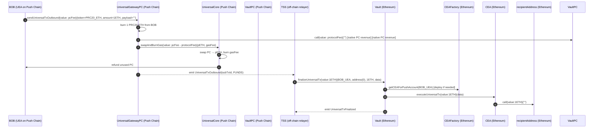

---

### 2.2 Source-Chain Token Withdrawal (WITH BURN)

**Scenario**: BOB burns PRC20-USDC on Push Chain and withdraws 1000 USDC to `recipientAddress`
on Ethereum. The USDC lands on the source chain — it does not return to Push Chain.

**Push Chain call**: `token=PRC20_USDC, amount=1000e6, payload=""` → `TX_TYPE.FUNDS`.

**Vault actions**: Transfers 1000e6 USDC to CEA (`safeTransfer`), then calls `CEA.executeUniversalTx`.

**Multicall payload** (TSS-crafted):
```solidity
Multicall[] memory calls = new Multicall[](1);
calls[0] = Multicall({
    to:    USDC_ADDRESS,
    value: 0,
    data:  abi.encodeCall(IERC20.transfer, (recipientAddress, 1000e6))
});
bytes memory data = abi.encode(calls);
```

**Result**: `recipientAddress` on Ethereum receives 1000 USDC. Gas fees paid separately in native PC (swapped to pETH, gasFee burned, protocolFee to VaultPC).

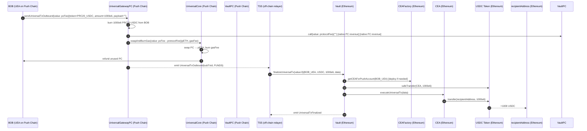

---

### 2.3 Source-Chain Native Withdrawal (WITHOUT BURN — CEA balance)

**Scenario**: BOB's CEA already holds ETH from a prior deposit or DeFi yield. BOB wants
to send 0.5 ETH from the CEA directly to `recipientAddress` on Ethereum without burning
any PRC20 on Push Chain.

**Push Chain call**: `amount=0`, `payload=<multicallCalldata>` → `TX_TYPE.GAS_AND_PAYLOAD`. No burn.

**Vault actions**: `finalizeUniversalTx{value: 0}` — no ETH forwarded from Vault.
CEA uses its own pre-existing balance.

**Multicall payload** (TSS-crafted):
```solidity
Multicall[] memory calls = new Multicall[](1);
calls[0] = Multicall({ to: recipientAddress, value: 0.5 ether, data: bytes("") });
// CEA spends its own pre-existing 0.5 ETH
bytes memory data = abi.encode(calls);
```

**Result**: `recipientAddress` receives 0.5 ETH. BOB's PRC20-ETH is unchanged (no burn). Gas fees paid in native PC.

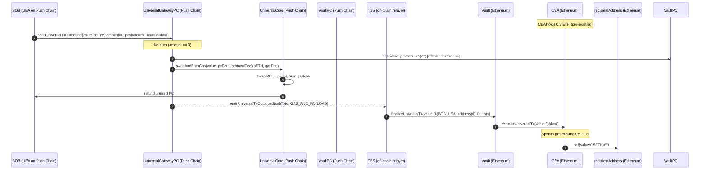

---

### 2.4 Source-Chain Token Withdrawal (WITHOUT BURN — CEA balance)

**Scenario**: BOB's CEA already holds USDC (e.g., received as Aave yield). BOB wants to
send 200 USDC directly to `recipientAddress` on Ethereum without burning any PRC20.

**Push Chain call**: `amount=0`, `payload=<multicallCalldata>` → `TX_TYPE.GAS_AND_PAYLOAD`. No burn.

**Vault actions**: `finalizeUniversalTx{value: 0}` with no token transfer — CEA uses its own balance.

**Multicall payload** (TSS-crafted):
```solidity
Multicall[] memory calls = new Multicall[](1);
calls[0] = Multicall({
    to:    USDC_ADDRESS,
    value: 0,
    data:  abi.encodeCall(IERC20.transfer, (recipientAddress, 200e6))
    // CEA calls token.transfer directly from its own balance
});
bytes memory data = abi.encode(calls);
```

**Result**: `recipientAddress` receives 200 USDC. CEA's USDC balance reduced. No PRC20 burned. Gas fees paid in native PC.

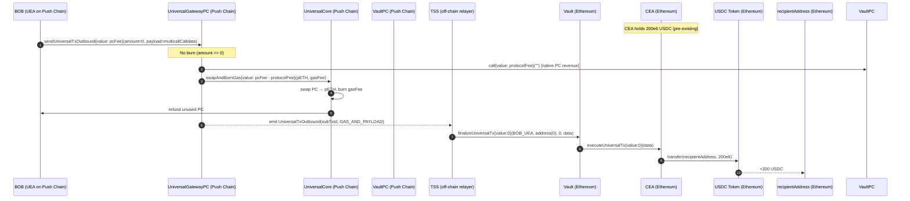

---

> **UEA Withdrawals** — moving tokens from the CEA back to BOB's UEA on Push Chain — are
> covered in Category 3 (CEA Self-Call Flows), specifically sections 4.1–4.4.

---

## 3. Category 2 — DeFi / Arbitrary Execution Flows

These flows execute arbitrary contract calls on the external chain using CEA as the execution
context. The multicall payload encodes the protocol interactions.

---

### 3.1 Execute with Native via BURN only

**Scenario**: BOB burns 1 PRC20-ETH and executes a Uniswap swap on Ethereum with those funds.

**Push Chain call**: `token=PRC20_ETH, amount=1 ether, payload=<swapCalldata>` → `FUNDS_AND_PAYLOAD`.

**Vault** sends 1 ETH to CEA via `executeUniversalTx{value: 1 ether}`.

**Multicall payload** (TSS-crafted):
```solidity
Multicall[] memory calls = new Multicall[](1);
calls[0] = Multicall({
    to:    UNISWAP_ROUTER,
    value: 1 ether,
    data:  abi.encodeCall(IUniswapRouter.exactInputSingle, (swapParams))
});
bytes memory data = abi.encode(calls);
```

**Result**: Swap output tokens arrive in CEA. BOB's PRC20-ETH reduced by `1 ether` only (gas fees paid separately in native PC).

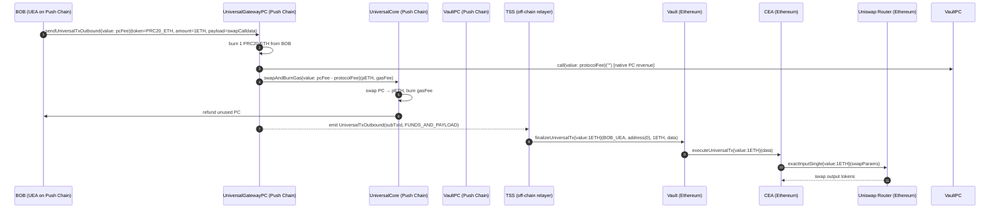

---

### 3.2 Execute with Native via CEA Balance only (no burn)

**Scenario**: BOB's CEA already holds 0.5 ETH. BOB instructs it to call a contract on Ethereum
without burning any PRC20 on Push Chain.

**Push Chain call**: `amount=0`, `payload=<targetCalldata>` → `TX_TYPE.GAS_AND_PAYLOAD`. No burn.

**Vault** calls `CEA.executeUniversalTx{value: 0}` — no ETH forwarded.

**Multicall payload** (TSS-crafted):
```solidity
Multicall[] memory calls = new Multicall[](1);
calls[0] = Multicall({ to: TARGET_CONTRACT, value: 0.5 ether, data: targetCalldata });
// CEA spends its own pre-existing 0.5 ETH balance
bytes memory data = abi.encode(calls);
```

**Result**: CEA ETH balance reduced by 0.5. No PRC20 burned. Gas fees paid in native PC.

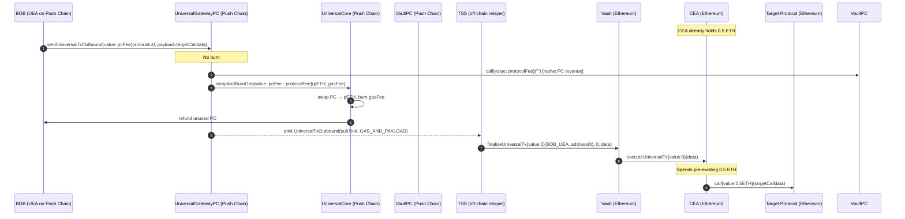

---

### 3.3 Execute with Native via CEA Balance + BURN (hybrid)

**Scenario**: CEA holds 0.3 ETH but the target requires 0.8 ETH. BOB burns 0.5 PRC20-ETH;
Vault tops up the CEA. The multicall spends the combined 0.8 ETH.

**Push Chain call**: `amount=0.5 ether, payload=<targetCalldata>` → `FUNDS_AND_PAYLOAD`.

**Vault** calls `CEA.executeUniversalTx{value: 0.5 ether}`. CEA now holds `0.3 + 0.5 = 0.8 ETH`.

**Multicall payload** (TSS-crafted):
```solidity
Multicall[] memory calls = new Multicall[](1);
calls[0] = Multicall({ to: TARGET_CONTRACT, value: 0.8 ether, data: targetCalldata });
// Draws on 0.5 ETH from Vault + 0.3 ETH pre-existing in CEA
bytes memory data = abi.encode(calls);
```

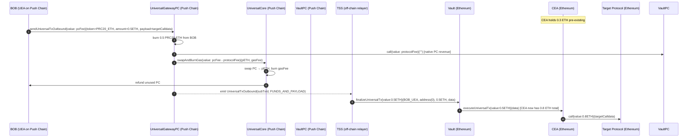

---

### 3.4 Execute with Token via BURN only

**Scenario**: BOB burns 500 PRC20-USDC and deposits it into Aave via CEA.

**Push Chain call**: `token=PRC20_USDC, amount=500e6, payload=<aaveCalldata>` → `FUNDS_AND_PAYLOAD`.

**Vault** sends 500e6 USDC to CEA (`safeTransfer`), then calls `CEA.executeUniversalTx`.

**Multicall payload** (TSS-crafted):
```solidity
Multicall[] memory calls = new Multicall[](2);
calls[0] = Multicall({ to: USDC_ADDRESS, value: 0, data: abi.encodeCall(IERC20.approve, (AAVE_POOL, 500e6)) });
calls[1] = Multicall({ to: AAVE_POOL, value: 0, data: abi.encodeCall(IAavePool.supply, (USDC_ADDRESS, 500e6, address(CEA), 0)) });
bytes memory data = abi.encode(calls);
```

**Result**: CEA holds aUSDC receipt tokens. BOB's PRC20-USDC reduced by `500e6` only (gas fees paid separately in native PC).

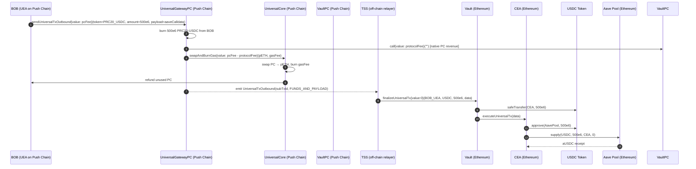

---

### 3.5 Execute with Token via CEA Balance only (no burn)

**Scenario**: CEA already holds 200 USDC. BOB instructs it to deposit into Aave without
burning any PRC20.

**Push Chain call**: `amount=0`, `payload=<aaveCalldata>` → `TX_TYPE.GAS_AND_PAYLOAD`. No burn.

**Vault** calls `CEA.executeUniversalTx{value: 0}` with no token transfer — CEA uses its own balance.

**Multicall payload** (same structure as 3.4, but CEA already holds the USDC):
```solidity
Multicall[] memory calls = new Multicall[](2);
calls[0] = Multicall({ to: USDC_ADDRESS, value: 0, data: abi.encodeCall(IERC20.approve, (AAVE_POOL, 200e6)) });
calls[1] = Multicall({ to: AAVE_POOL, value: 0, data: abi.encodeCall(IAavePool.supply, (USDC_ADDRESS, 200e6, address(CEA), 0)) });
bytes memory data = abi.encode(calls);
```

---

### 3.6 Execute with Token via CEA Balance + BURN (hybrid)

**Scenario**: CEA holds 100 USDC. BOB wants to supply 600 USDC to Aave. He burns 500 PRC20-USDC;
Vault sends 500 USDC to CEA. CEA now has 600 USDC and executes the Aave deposit.

**Push Chain call**: `token=PRC20_USDC, amount=500e6, payload=<aaveCalldata>` → `FUNDS_AND_PAYLOAD`.

**Vault** sends 500e6 USDC to CEA (`safeTransfer`). CEA balance becomes `100e6 + 500e6 = 600e6`.
The multicall executes approve + supply for the full 600e6, drawing on both Vault-supplied and
pre-existing balance.

---

## 4. Category 3 — CEA Self-Call Flows (sendUniversalTxFromCEA)

These flows move tokens **from the external chain back to the user's UEA on Push Chain**. The
CEA calls `UniversalGateway.sendUniversalTxFromCEA`, bridging tokens inbound. In all cases
BOB burns PRC20 on Push Chain first — Vault supplies fresh tokens to the CEA, and the CEA's
multicall bridges them back inbound in the same execution.

> **Anti-spoof invariant** (`UniversalGateway.sol:359`): `req.recipient` must equal
> `CEAFactory.getUEAForCEA(msg.sender)`. The gateway enforces this unconditionally.
> Without it, a CEA could credit an arbitrary UEA.

> **fromCEA flag**: All events on this path emit `fromCEA=true` and `recipient=mappedUEA`.
> Push Chain uses this to credit BOB's existing UEA rather than deploying a new one for the
> CEA's address (CEA address ≠ UEA address).

All four TX_TYPEs are supported for CEA→UEA routes via `sendUniversalTxFromCEA`. The most common patterns are `FUNDS` and `FUNDS_AND_PAYLOAD` (examples below), but `GAS` and `GAS_AND_PAYLOAD` are also valid.

The general flow for all Category 3 cases:
```
BOB: sendUniversalTxOutbound{value: pcFee}(amount>0, payload=<multicallData>)
  [FUNDS_AND_PAYLOAD, burns PRC20, swaps PC → gas token (burn gasFee, protocolFee to VaultPC)]
  → TSS: Vault.finalizeUniversalTx(BOB_UEA, ..., data=<multicallData>)
  → CEA.executeUniversalTx(data)  [Vault supplies tokens to CEA]
  → multicall: [..., sendUniversalTxFromCEA(req{recipient=BOB_UEA})]
  → Gateway: isCEA ✓, anti-spoof ✓ → routes as FUNDS or FUNDS_AND_PAYLOAD
  → emit UniversalTx(fromCEA=true, recipient=BOB_UEA)
  → Push Chain credits BOB_UEA
```

---

### 4.1 FUNDS Native — with BURN

**Scenario**: BOB burns PRC20-ETH on Push Chain. Vault sends ETH to CEA. CEA immediately
bridges it back to BOB's UEA via `sendUniversalTxFromCEA`.

**Push Chain call**: `token=PRC20_ETH, amount=ethAmount, payload=<multicallData>` → `FUNDS_AND_PAYLOAD`.

**Multicall payload** (TSS-crafted):
```solidity
Multicall[] memory calls = new Multicall[](1);
calls[0] = Multicall({
    to:    UNIVERSAL_GATEWAY,
    value: ethAmount,
    data:  abi.encodeCall(IUniversalGateway.sendUniversalTxFromCEA, (UniversalTxRequest({
        recipient:       BOB_UEA,
        token:           address(0),
        amount:          ethAmount,
        payload:         bytes(""),
        revertRecipient: BOB_PUSH_ADDRESS,
        signatureData:   bytes("")
    })))
});
bytes memory data = abi.encode(calls);
```

Gateway infers `TX_TYPE.FUNDS` (native, amount>0, no payload). Epoch rate limit applies.
Push Chain mints PRC20-ETH to BOB's UEA.

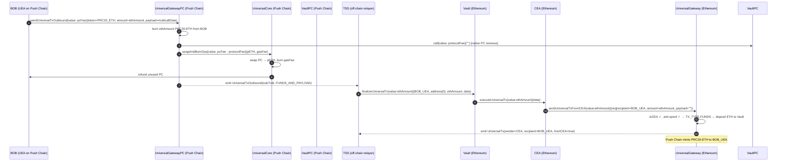

---

### 4.2 FUNDS ERC20 — with BURN

**Scenario**: BOB burns PRC20-USDC. Vault sends USDC to CEA. CEA approves the gateway and
calls `sendUniversalTxFromCEA` to bridge USDC back to Push Chain.

**Push Chain call**: `token=PRC20_USDC, amount=500e6, payload=<multicallData>` → `FUNDS_AND_PAYLOAD`.

**Multicall payload** (TSS-crafted):
```solidity
Multicall[] memory calls = new Multicall[](2);
// Step 1: approve gateway to pull USDC from CEA
calls[0] = Multicall({ to: USDC_ADDRESS, value: 0, data: abi.encodeCall(IERC20.approve, (UNIVERSAL_GATEWAY, 500e6)) });
// Step 2: bridge USDC back to Push Chain
calls[1] = Multicall({
    to:    UNIVERSAL_GATEWAY,
    value: 0,
    data:  abi.encodeCall(IUniversalGateway.sendUniversalTxFromCEA, (UniversalTxRequest({
        recipient:       BOB_UEA,
        token:           USDC_ADDRESS,
        amount:          500e6,
        payload:         bytes(""),
        revertRecipient: BOB_PUSH_ADDRESS,
        signatureData:   bytes("")
    })))
});
bytes memory data = abi.encode(calls);
```

> For ERC20, the CEA must approve the gateway before calling `sendUniversalTxFromCEA`.
> The gateway's `_handleDeposits` pulls USDC via `safeTransferFrom(CEA, Vault, amount)`.

Gateway infers `TX_TYPE.FUNDS`. Push Chain mints 500 PRC20-USDC to BOB's UEA.

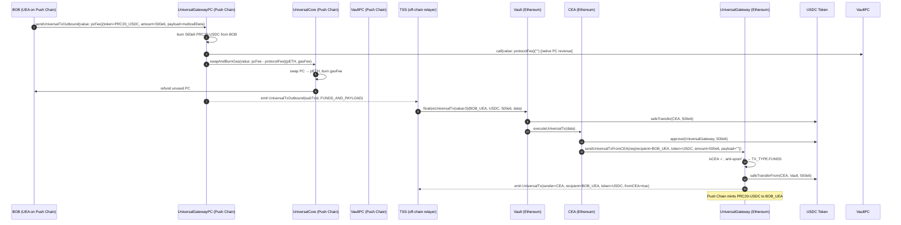

---

### 4.3 FUNDS Native — with BURN + CEA balance (hybrid)

**Scenario**: CEA holds 0.2 ETH. BOB burns 0.3 PRC20-ETH. CEA combines both (0.5 ETH total)
and bridges all of it back to BOB's UEA.

**Push Chain call**: `token=PRC20_ETH, amount=0.3 ether, payload=<multicallData>` → `FUNDS_AND_PAYLOAD`.

**Multicall payload**: Same structure as 4.1 but the Multicall `value` is the combined total
— Vault supplies 0.3 ETH; CEA's existing 0.2 ETH makes up the rest.

```solidity
calls[0] = Multicall({
    to:    UNIVERSAL_GATEWAY,
    value: 0.5 ether,   // 0.3 ETH from Vault + 0.2 ETH pre-existing in CEA
    data:  abi.encodeCall(IUniversalGateway.sendUniversalTxFromCEA, (UniversalTxRequest({
        recipient: BOB_UEA, token: address(0), amount: 0.5 ether,
        payload: bytes(""), revertRecipient: BOB_PUSH_ADDRESS, signatureData: bytes("")
    })))
});
```

Gateway infers `TX_TYPE.FUNDS`. Push Chain mints 0.5 PRC20-ETH to BOB's UEA.

---

### 4.4 FUNDS ERC20 — with BURN + CEA balance (hybrid)

**Scenario**: CEA already holds 100e6 USDC. BOB burns 400e6 PRC20-USDC. Vault sends 400e6
USDC to CEA. The multicall approves and bridges the combined 500e6 USDC back to Push Chain.

**Push Chain call**: `token=PRC20_USDC, amount=400e6, payload=<multicallData>` → `FUNDS_AND_PAYLOAD`.

**Multicall payload**: Same structure as 4.2 but approval and bridge amount is `500e6`
(`400e6` from Vault + `100e6` pre-existing in CEA).

```solidity
calls[0] = Multicall({ to: USDC_ADDRESS, value: 0,
    data: abi.encodeCall(IERC20.approve, (UNIVERSAL_GATEWAY, 500e6)) });
calls[1] = Multicall({ to: UNIVERSAL_GATEWAY, value: 0,
    data: abi.encodeCall(IUniversalGateway.sendUniversalTxFromCEA, (UniversalTxRequest({
        recipient: BOB_UEA, token: USDC_ADDRESS, amount: 500e6,
        payload: bytes(""), revertRecipient: BOB_PUSH_ADDRESS, signatureData: bytes("")
    })))
});
```

Gateway infers `TX_TYPE.FUNDS`. Pulls 500e6 USDC from CEA via `safeTransferFrom`.
Push Chain mints 500 PRC20-USDC to BOB's UEA.

---

### 4.5 FUNDS_AND_PAYLOAD Native — with BURN

**Scenario**: BOB burns PRC20-ETH, Vault funds CEA, CEA bridges ETH back to Push Chain
**and** attaches a payload for the UEA to execute on Push Chain (e.g., a governance vote).

**Push Chain call**: `token=PRC20_ETH, amount=ethAmount, payload=<multicallData>` → `FUNDS_AND_PAYLOAD`.

**Multicall payload**: Same as 4.1 but with `payload: pushChainPayload` in the inner request.

```solidity
calls[0] = Multicall({
    to:    UNIVERSAL_GATEWAY,
    value: ethAmount,
    data:  abi.encodeCall(IUniversalGateway.sendUniversalTxFromCEA, (UniversalTxRequest({
        recipient:       BOB_UEA,
        token:           address(0),
        amount:          ethAmount,
        payload:         pushChainPayload,   // non-empty → FUNDS_AND_PAYLOAD on external chain
        revertRecipient: BOB_PUSH_ADDRESS,
        signatureData:   bytes("")
    })))
});
```

Gateway infers `TX_TYPE.FUNDS_AND_PAYLOAD`. Epoch rate limit applies.
Push Chain credits BOB's UEA with PRC20-ETH **and** executes `pushChainPayload` via UEA.

---

### 4.6 FUNDS_AND_PAYLOAD ERC20 — with BURN

**Scenario**: BOB burns PRC20-USDC, Vault funds CEA, CEA bridges USDC back to Push Chain
**and** attaches a Push Chain payload.

**Push Chain call**: `token=PRC20_USDC, amount=500e6, payload=<multicallData>` → `FUNDS_AND_PAYLOAD`.

**Multicall payload**: Same as 4.2 but with `payload: pushChainPayload` in the inner request.

```solidity
calls[0] = Multicall({ to: USDC_ADDRESS, value: 0,
    data: abi.encodeCall(IERC20.approve, (UNIVERSAL_GATEWAY, 500e6)) });
calls[1] = Multicall({ to: UNIVERSAL_GATEWAY, value: 0,
    data: abi.encodeCall(IUniversalGateway.sendUniversalTxFromCEA, (UniversalTxRequest({
        recipient: BOB_UEA, token: USDC_ADDRESS, amount: 500e6,
        payload: pushChainPayload,   // non-empty → FUNDS_AND_PAYLOAD on external chain
        revertRecipient: BOB_PUSH_ADDRESS, signatureData: bytes("")
    })))
});
```

Gateway infers `TX_TYPE.FUNDS_AND_PAYLOAD`. Push Chain credits BOB's UEA with PRC20-USDC
**and** executes `pushChainPayload` via UEA.

---

### 4.7 FUNDS_AND_PAYLOAD Native — with BURN + CEA balance (hybrid)

**Scenario**: CEA holds 0.2 ETH. BOB burns 0.3 PRC20-ETH. CEA combines both (0.5 ETH) and
bridges it back to Push Chain while carrying a Push Chain payload.

**Push Chain call**: `token=PRC20_ETH, amount=0.3 ether, payload=<multicallData>` → `FUNDS_AND_PAYLOAD`.

**Multicall payload**: Same as 4.5 but the Multicall `value` is the combined 0.5 ETH total
and the inner `amount` reflects the full bridged amount.

```solidity
calls[0] = Multicall({
    to:    UNIVERSAL_GATEWAY,
    value: 0.5 ether,   // 0.3 ETH from Vault + 0.2 ETH pre-existing in CEA
    data:  abi.encodeCall(IUniversalGateway.sendUniversalTxFromCEA, (UniversalTxRequest({
        recipient: BOB_UEA, token: address(0), amount: 0.5 ether,
        payload: pushChainPayload, revertRecipient: BOB_PUSH_ADDRESS, signatureData: bytes("")
    })))
});
```

Gateway infers `TX_TYPE.FUNDS_AND_PAYLOAD`. Push Chain credits BOB's UEA with 0.5 PRC20-ETH
**and** executes `pushChainPayload` via UEA.

---

### 4.8 FUNDS_AND_PAYLOAD ERC20 — with BURN + CEA balance (hybrid)

**Scenario**: CEA holds 100e6 USDC. BOB burns 400e6 PRC20-USDC. CEA bridges the combined
500e6 USDC back to Push Chain while carrying a Push Chain payload.

**Push Chain call**: `token=PRC20_USDC, amount=400e6, payload=<multicallData>` → `FUNDS_AND_PAYLOAD`.

**Multicall payload**: Same as 4.6 but approval and bridge amount is `500e6`, reflecting the
combined Vault-supplied (`400e6`) and pre-existing (`100e6`) USDC balances.

```solidity
calls[0] = Multicall({ to: USDC_ADDRESS, value: 0,
    data: abi.encodeCall(IERC20.approve, (UNIVERSAL_GATEWAY, 500e6)) });
calls[1] = Multicall({ to: UNIVERSAL_GATEWAY, value: 0,
    data: abi.encodeCall(IUniversalGateway.sendUniversalTxFromCEA, (UniversalTxRequest({
        recipient: BOB_UEA, token: USDC_ADDRESS, amount: 500e6,
        payload: pushChainPayload, revertRecipient: BOB_PUSH_ADDRESS, signatureData: bytes("")
    })))
});
```

Gateway infers `TX_TYPE.FUNDS_AND_PAYLOAD`. Push Chain credits BOB's UEA with 500 PRC20-USDC
**and** executes `pushChainPayload` via UEA.

---

## 5. Category 4 — Revert Flows

Revert flows return funds to the user when a cross-chain transaction is rejected or fails
after TSS has already taken custody.

---

### 5.1 Revert ERC20 Token

**Scenario**: BOB's USDC withdrawal was rejected on Push Chain. TSS returns the USDC.

**Call chain**:
```
TSS → Vault.revertUniversalTxToken(subTxId, uSubTxId, USDC, amount, revertInstruction)
    → Vault: validate token support + balance, safeTransfer(gateway, amount)
    → gateway.revertUniversalTxToken(...) → safeTransfer(revertRecipient, amount)
    → emit RevertUniversalTx
```

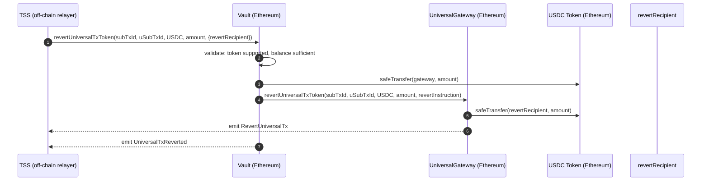

---

### 5.2 Revert Native Token

**Scenario**: BOB's native ETH withdrawal was rejected. ETH is held in the gateway
(deposited during the original inbound `sendUniversalTx` call). TSS calls `revertUniversalTx`
directly — no Vault involvement.

**Call chain**:
```
TSS → UniversalGateway.revertUniversalTx{value: amount}(subTxId, uSubTxId, amount, revertInstruction)
    → gateway: call{value: amount}(revertRecipient)
    → emit RevertUniversalTx
```

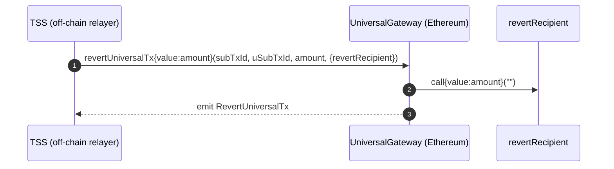

---

## 6. Null Execution (CEA Pre-funding)

A **null execution** is `Vault.finalizeUniversalTx` called with `data = bytes("")`. The CEA
receives tokens or ETH but executes nothing — funds are held in the CEA for later use.

**When TSS uses it**:
- Pre-fund a CEA before the user's actual execution request arrives.
- Stage funds for a multi-step operation where execution happens in a later transaction.

**Later retrieval**: BOB initiates a `GAS_AND_PAYLOAD` outbound. TSS calls
`finalizeUniversalTx` again with a non-empty multicall that draws on the pre-funded CEA
balance (pattern from sections 3.2, 3.5, or any Category 3 no-burn flow).

---

## 7. CEA Migration (Special Case)

CEA Migration is a special-purpose outbound flow that upgrades a user's CEA to a new
implementation version. It is not a funds transfer — it is a logic upgrade to the user's
on-chain execution account.

### 7.1 What CEA Migration Is

CEAs are deployed as minimal proxies (clones) by `CEAFactory`. When a new CEA implementation
is published, existing users need a way to upgrade their deployed CEA instance to the new
version. Migration is the mechanism for this.

**Key properties**:
- The migration payload is a top-level `MIGRATION_SELECTOR` prefix, distinct from a `Multicall`.
- The CEA `_handleExecution` three-way branch recognises `isMigration(payload)` and routes to
  `_handleMigration()` instead of `_handleMulticall`.
- `_handleMigration` calls `factory.CEA_MIGRATION_CONTRACT()` to fetch the upgrade contract
  address, then `delegatecall`s `migrateCEA()` on it.
- Migration rejects `msg.value > 0` — it is a logic upgrade only, not a value transfer.
- Migration contract must be set on `CEAFactory` (non-zero address) or the call reverts.

### 7.2 Migration Payload Format

```solidity
// Migration payload is just the 4-byte selector — no additional data
bytes memory migrationPayload = abi.encodePacked(MIGRATION_SELECTOR);
// MIGRATION_SELECTOR is defined in Types.sol
```

Contrast with Multicall payload, which is `MULTICALL_SELECTOR + abi.encode(Multicall[])`.

### 7.3 CEA Migration Flow

**Preconditions**:
- A new CEA implementation is deployed.
- `CEAFactory.CEA_MIGRATION_CONTRACT` is set to the new migration contract address.
- BOB's CEA is on an older version.

**Push Chain call**: `amount=0`, `payload=<migrationPayload>` → `TX_TYPE.GAS_AND_PAYLOAD`. No burn.

**TSS action**: Observes `UniversalTxOutbound` and calls `Vault.finalizeUniversalTx` with
`token=address(0), amount=0` and `data=migrationPayload`.

**Vault actions**: Gets CEA for BOB's UEA (does not deploy — CEA must already exist to be
upgraded), calls `CEA.executeUniversalTx{value: 0}(migrationPayload)`.

**CEA execution**:
1. `_handleExecution` receives `migrationPayload`.
2. `isMulticall(payload)` → false (wrong selector).
3. `isMigration(payload)` → true.
4. `_handleMigration()`: fetches `factory.CEA_MIGRATION_CONTRACT()`, `delegatecall`s `migrateCEA()`.
5. The migration contract executes in the CEA's storage context, upgrading internal state.

**Result**: BOB's CEA is upgraded to the new implementation. No tokens moved. No PRC20 burned.

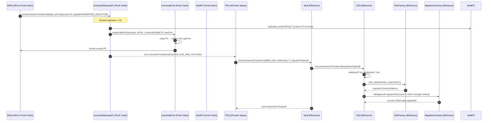

### 7.4 Error Conditions

| Condition                                                         | Error                                        |
| ----------------------------------------------------------------- | -------------------------------------------- |
| `msg.value > 0` sent with migration payload                       | `CEAErrors.InvalidInput()`                   |
| `factory.CEA_MIGRATION_CONTRACT() == address(0)`                  | `CEAErrors.InvalidCall()`                    |
| `delegatecall` to migration contract fails                        | `CEAErrors.ExecutionFailed()`                |
| CEA not yet deployed (BOB has no CEA)                             | Vault deploys CEA first; migration then runs |
| Multicall payload accidentally sent instead of migration selector | Routes to `_handleMulticall`, not migration  |

---

## 8. Rescue Funds Flow (`TX_TYPE.RESCUE_FUNDS`)

### 8.1 Problem Statement

When a CEA triggers an inbound call via `UniversalGateway.sendUniversalTxFromCEA()`, tokens are locked in the source chain's Vault. In an edge case where tokens are locked but never minted on Push Chain, there is no standard way to recover them.

### 8.2 Flow Overview

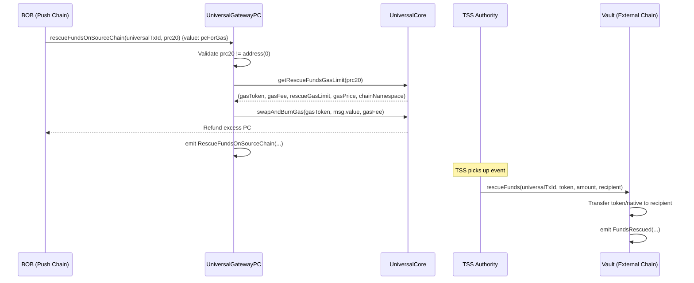

### 8.3 Push Chain Side (`UniversalGatewayPC.rescueFundsOnSourceChain`)

**Caller:** Any user (no role required).

**Steps:**
1. Validate `prc20 != address(0)`.
2. Call `IUniversalCore(UNIVERSAL_CORE).getRescueFundsGasLimit(prc20)`, which returns `(gasToken, gasFee, rescueGasLimit, gasPrice, chainNamespace)` — UniversalCore is the single source of truth for rescue gas parameters.
3. Swap `msg.value` → gas token via `_swapAndCollectFees(gasToken, msg.value, gasFee)`. Excess PC refunded to caller.
4. Emit `RescueFundsOnSourceChain` with `TX_TYPE.RESCUE_FUNDS`.

**Key differences from `sendUniversalTxOutbound`:**
- No PRC20 burn.
- No protocol fee.
- No nonce or subTxId generation.
- Gas limit (`rescueGasLimit`) and pricing are sourced from `UniversalCore.getRescueFundsGasLimit` — UGPC has no local rescue gas storage variable or setter.

### 8.4 External Chain Side (`Vault.rescueFunds`)

**Caller:** TSS only (`TSS_ROLE`).

**Steps:**
1. Validate `amount > 0` and `recipient != address(0)`.
2. Transfer token (ERC20 via `safeTransfer`) or native (via low-level `call`) to `recipient`.
3. Emit `FundsRescued(universalTxId, token, amount, recipient)`.

**No token support check** — TSS can rescue even delisted tokens.

### 8.5 Error Conditions

| Condition (UGPC)                    | Error            |
| ----------------------------------- | ---------------- |
| `prc20 == address(0)`              | `ZeroAddress`    |
| `gasPrice == 0` for chain           | `InvalidData`    |
| `gasToken == address(0)` for chain  | `InvalidData`    |
| `msg.value == 0`                    | `ZeroAmount`     |

| Condition (Vault)                   | Error                |
| ----------------------------------- | -------------------- |
| `amount == 0`                       | `ZeroAmount`         |
| `recipient == address(0)`           | `InvalidRecipient`   |
| Insufficient balance                | `InsufficientBalance`|
| Native transfer fails               | `WithdrawFailed`     |
| Caller not TSS                      | AccessControl revert |
